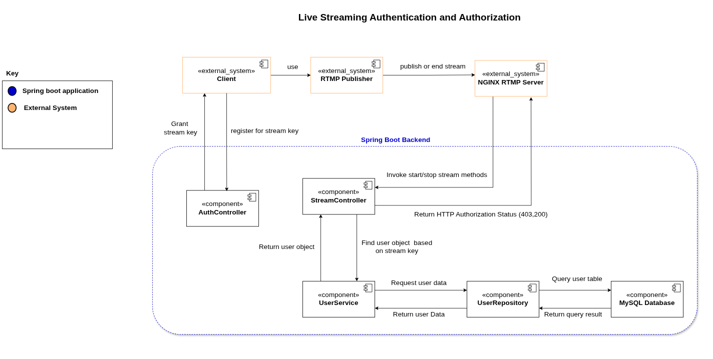

# Authentication and Authorization

## 🔒 Description

The motivation for this project is to demonstrate the implementation of **authentication and authorization architectural tactics** by integrating them into an existing technology — rather than building every component from scratch. Specifically, this prototype shows how to extend the functionality of the **NGINX RTMP module**, a lightweight media server, by connecting it to a **Spring Boot application** that enforces **secure streaming behavior**.

Instead of developing a full live streaming service, this project uses **NGINX RTMP** as an off-the-shelf solution for handling **RTMP stream ingestion and playback**. Through its built-in **on_publish** and **on_publish_done** hooks, NGINX communicates with a **Spring Boot backend** that validates whether a stream should be allowed based on the **stream key** provided.

The key requirement is that only **registered users with valid stream keys** are allowed to publish streams, while **viewers (the public) are not restricted from watching**. When a stream is started (**on_publish**), the Spring Boot service checks the key against a **MySQL-backed user database** and approves or rejects the request. When the stream ends (**on_publish_done**), the backend can optionally log or respond to the termination of the stream session.

This project demonstrates:

- The practical integration of multiple technologies to meet a specific **security requirement**
- How to use **authentication and stream-level authorization** in a working system
- How design decisions (like using **on_publish**) can be implemented and tested in a constrained, prototype setting

Ultimately, this project emphasizes the real-world relevance of integrating and extending existing components to meet system-specific goals, fulfilling the assignment’s objective of not just designing, but **implementing and validating architectural tactics**.

## Architecture

### Components Diagram



---

## 🚀 Getting Started

### Prerequisites

- Java 17+
- Maven
- An IDE like IntelliJ IDEA or Eclipse
- Docker
- Streaming client, you can use OBS or ffmpeg on the CLI
- A Client to view the stream video, you may use VLC other players or use ffplay on the CLI

### Dependencies

The project is build using docker compose which contains the following services:
- **Spring Boot**: The backend service that handles authentication and authorization.
- **MySQL**: The database for storing user credentials and stream keys.
- **NGINX RTMP**: The media server that handles RTMP streaming and communicates with the Spring Boot service.
---

## 🏗️ How to Run

1. Clone the repository:

   ```bash
   git clone https://github.com/your-username/authentication-and-authorization.git
   cd authentication-and-authorization
   ```

2. Build the services using Docker compose:

   ```bash
   docker compose up -d
   ```

3. Register for a streaming key by send a post request to `localhost:8080/api/auth/register`.  There are many ways that you may do this.
you may use postman, insomnia, etc .... or an classic curl
```bash
curl -X POST http://localhost:8080/api/auth/register \
  -H "Content-Type: application/json" \
  -d '{
    "username": "yolo2",
    "password": "mySuperSecret",
    "confirmPassword": "mySuperSecret",
    "email": "myEmail2@gmail.com"
  }'
```

You should see a response similar to
```bash
{
  "username": "yolo2",
  "streamKey": "generated-stream-key"
}
```

4. Copy your stream key. You will need this to paste in obs or ffmpeg to start streaming.
5. Start streaming using your favorite streaming client (e.g., OBS, ffmpeg) with the RTMP URL:
   ```
   rtmp://localhost/live/<your-stream-key>
   ```
 For example if you are using OBS, go to `Settings` -> `Stream`, select `Custom` as the service, and enter the following URL:
   ```
   rtmp://localhost/live
   ```
   In the stream key field, paste your generated stream key.  

6. Click on start stream in OBS or run the following ffmpeg command 

   
7. View the stream using a media player that supports RTMP (e.g., VLC, ffplay) with the URL:
   ```
   http://localhost:9090/live/<your username>/index.m3u8
   ```
---

[//]: # ()
[//]: # (## 👥 User Roles)

[//]: # ()
[//]: # (The system defines multiple users with different access rights:)

[//]: # ()
[//]: # (| Username | Password   | Role         |)

[//]: # (| -------- | ---------- | ------------ |)

[//]: # (| `admin`  | `admin123` | `ROLE_ADMIN` |)

[//]: # (| `user`   | `user123`  | `ROLE_USER`  |)

[//]: # ()
[//]: # (---)

[//]: # ()
[//]: # (## 🔐 Role-Based Access Control)

[//]: # ()
[//]: # (Example access rules:)

[//]: # ()
[//]: # (- `/api/public` – Accessible to everyone &#40;no authentication required&#41;)

[//]: # (- `/api/user` – Requires `ROLE_USER` or higher)

[//]: # (- `/api/admin` – Requires `ROLE_ADMIN`)

[//]: # ()
[//]: # (These are configured using Spring Security's role-based annotations or HTTP security configuration.)

[//]: # ()
[//]: # (---)

[//]: # ()
[//]: # (## 🛡️ Security Tactics Demonstrated)

[//]: # ()
[//]: # (- **Authentication**: Verifying user identity using HTTP Basic Authentication with username/password)

[//]: # (- **Authorization**: Controlling access based on user roles using Spring Security's RBAC)

[//]: # (- **Role-Based Access Control &#40;RBAC&#41;**: Different endpoints require different role levels)

[//]: # (- **Password Encoding**: User passwords are securely encoded using BCrypt)

[//]: # ()
[//]: # (## 🔍 API Endpoints)

[//]: # ()
[//]: # (| Endpoint | Authentication Required | Authorized Roles | Description |)

[//]: # (|----------|------------------------|------------------|-------------|)

[//]: # (| `GET /api/public` | ❌ No | Everyone | Public information accessible to all |)

[//]: # (| `GET /api/user` | ✅ Yes | USER, ADMIN | User-level protected resources |)

[//]: # (| `GET /api/admin` | ✅ Yes | ADMIN only | Admin-only protected resources |)

[//]: # (| `GET /api/status` | ✅ Yes | USER, ADMIN | Authentication status information |)

[//]: # ()
[//]: # (## 🧪 Testing)

[//]: # ()
[//]: # (Run the test suite to verify authentication and authorization:)

[//]: # ()
[//]: # (```bash)

[//]: # (mvn test)

[//]: # (```)

[//]: # ()
[//]: # (The tests verify:)

[//]: # ()
[//]: # (- Public endpoints are accessible without authentication)

[//]: # (- Protected endpoints require valid credentials)

[//]: # (- Role-based access control works correctly)

[//]: # (- Admin endpoints reject non-admin users)

## 📚 References

- [Spring Security Docs](https://docs.spring.io/spring-security/site/docs/current/reference/html5/)
- [Spring Initializr](https://start.spring.io)
- [Nginx RTMP module](https://github.com/mannyamorim/nginx-rtmp-module)
- [Nginx](https://docs.nginx.com/)
- [Building a live streaming system with Nginx By Ben Wilber](https://benwilber.github.io/nginx/rtmp/live/video/streaming/2018/03/25/building-a-live-video-streaming-website-part-1-start-streaming.html)
